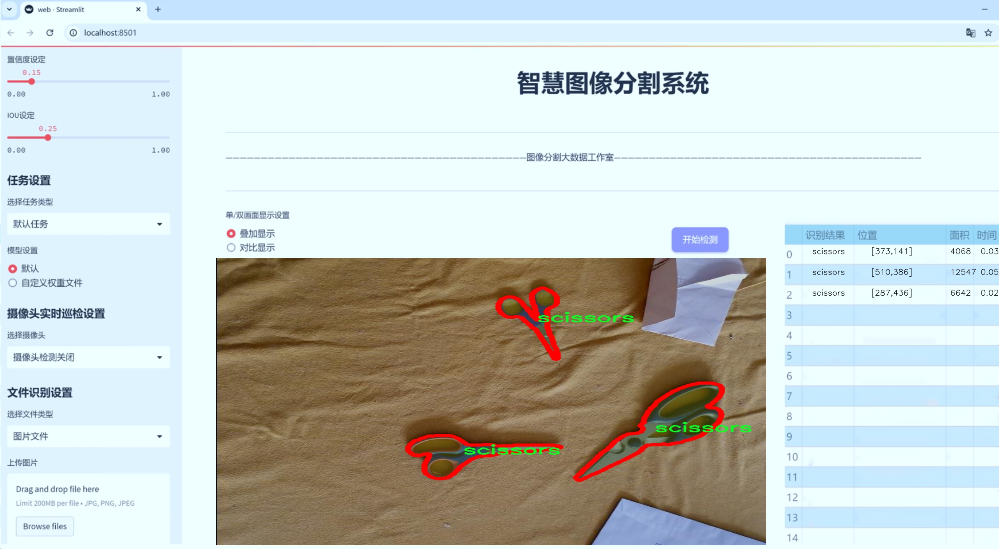
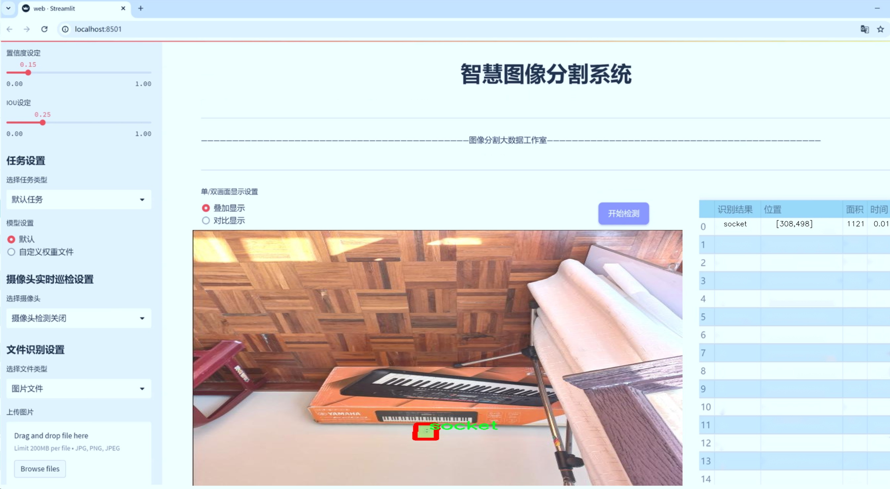
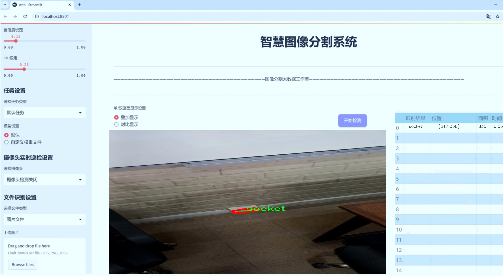
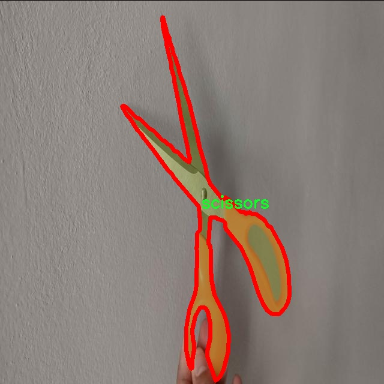
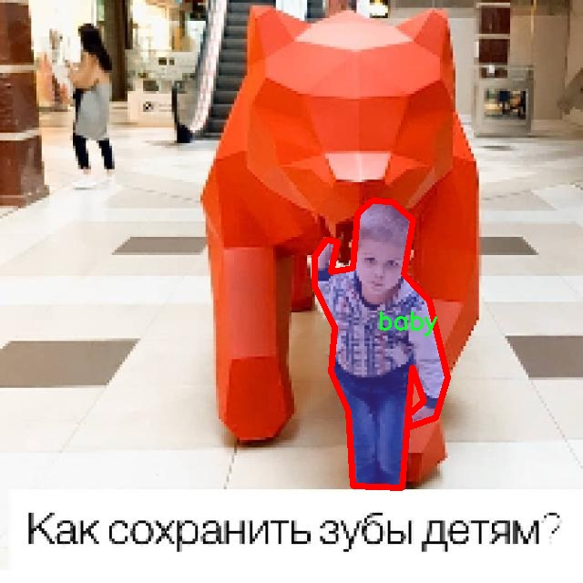
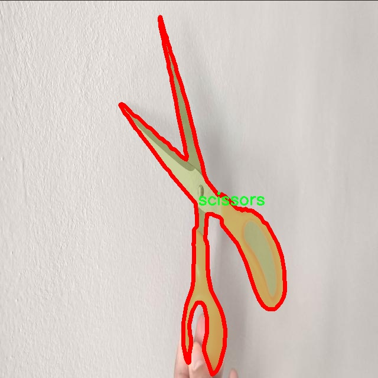
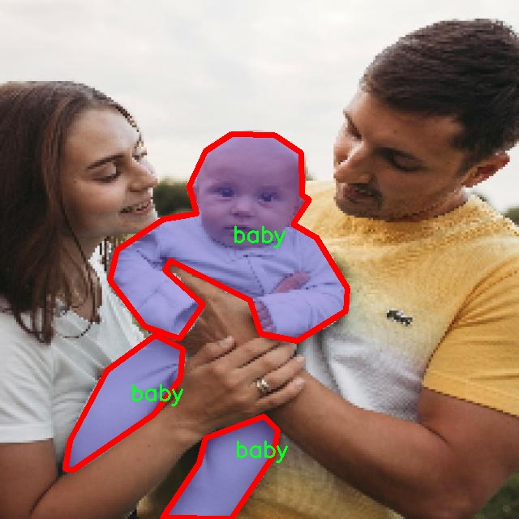
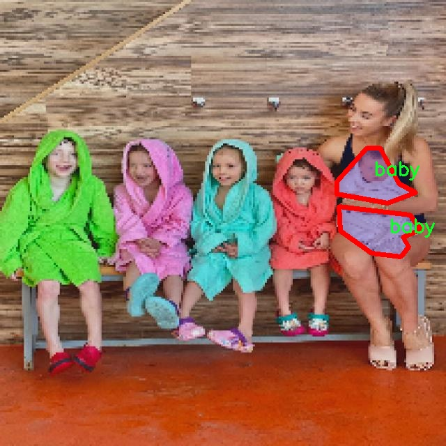

# 婴儿监护环境识别图像分割系统源码＆数据集分享
 [yolov8-seg-C2f-DCNV3＆yolov8-seg-C2f-SCcConv等50+全套改进创新点发刊_一键训练教程_Web前端展示]

### 1.研究背景与意义

项目参考[ILSVRC ImageNet Large Scale Visual Recognition Challenge](https://gitee.com/YOLOv8_YOLOv11_Segmentation_Studio/projects)

项目来源[AAAI Global Al lnnovation Contest](https://kdocs.cn/l/cszuIiCKVNis)

研究背景与意义

随着社会的发展和生活水平的提高，婴儿护理逐渐受到越来越多家庭的重视。婴儿监护不仅仅是对其生理需求的满足，更包括对其生活环境的安全监控。近年来，智能监护技术的迅速发展为家庭提供了更加便捷和高效的婴儿监护解决方案。在这一背景下，基于计算机视觉的图像分割技术，尤其是改进的YOLOv8模型，展现出了广阔的应用前景。YOLO（You Only Look Once）系列模型因其高效的实时检测能力而广受欢迎，而YOLOv8的改进则进一步提升了其在复杂环境下的表现，特别是在多类别物体的实例分割任务中。

本研究旨在构建一个基于改进YOLOv8的婴儿监护环境识别图像分割系统，以实现对婴儿周围环境的智能监测。该系统将利用一个包含3700张图像的数据集，该数据集涵盖了四个主要类别：婴儿、刀具、剪刀和插座。这些类别不仅是婴儿日常生活中可能接触到的物体，而且也代表了潜在的安全隐患。因此，准确识别和分割这些物体，对于保护婴儿的安全至关重要。

在当前的研究中，虽然已有一些基于图像处理的婴儿监护系统，但大多数系统在物体识别和环境理解方面仍存在一定的局限性。传统的监控系统往往依赖于静态图像或简单的运动检测，无法有效应对复杂环境中的多物体识别与分割。而改进YOLOv8模型的引入，将为这一领域带来新的突破。通过对图像进行实例分割，系统不仅能够识别出各类物体，还能准确定位它们在图像中的位置，从而实现更为细致的环境监控。

此外，本研究的意义还在于推动计算机视觉技术在实际应用中的落地。通过构建一个高效的婴儿监护环境识别系统，我们不仅可以为家庭提供更为安全的育儿环境，还能为相关领域的研究提供宝贵的数据和经验。随着技术的不断进步，未来的婴儿监护系统有望集成更多智能功能，如实时报警、行为分析等，从而进一步提升婴儿护理的安全性和智能化水平。

综上所述，基于改进YOLOv8的婴儿监护环境识别图像分割系统的研究，不仅具有重要的学术价值，也具有广泛的社会应用前景。通过深入探讨该系统的设计与实现，我们期望能够为婴儿监护技术的发展贡献一份力量，为家庭的育儿安全提供更加坚实的保障。

### 2.图片演示







##### 注意：由于此博客编辑较早，上面“2.图片演示”和“3.视频演示”展示的系统图片或者视频可能为老版本，新版本在老版本的基础上升级如下：（实际效果以升级的新版本为准）

  （1）适配了YOLOV8的“目标检测”模型和“实例分割”模型，通过加载相应的权重（.pt）文件即可自适应加载模型。

  （2）支持“图片识别”、“视频识别”、“摄像头实时识别”三种识别模式。

  （3）支持“图片识别”、“视频识别”、“摄像头实时识别”三种识别结果保存导出，解决手动导出（容易卡顿出现爆内存）存在的问题，识别完自动保存结果并导出到tempDir中。

  （4）支持Web前端系统中的标题、背景图等自定义修改，后面提供修改教程。

  另外本项目提供训练的数据集和训练教程,暂不提供权重文件（best.pt）,需要您按照教程进行训练后实现图片演示和Web前端界面演示的效果。

### 3.视频演示

[3.1 视频演示](https://www.bilibili.com/video/BV16cypY2E9x/)

### 4.数据集信息展示

##### 4.1 本项目数据集详细数据（类别数＆类别名）

nc: 4
names: ['baby', 'knife', 'scissors', 'socket']


##### 4.2 本项目数据集信息介绍

数据集信息展示

在本研究中，我们构建了一个专门用于训练改进YOLOv8-seg的婴儿监护环境识别图像分割系统的数据集，命名为“baby-monitoring”。该数据集旨在提升婴儿监护环境的安全性，通过精准识别潜在危险物品，确保婴儿在日常生活中的安全。数据集包含四个主要类别，分别是“baby”（婴儿）、“knife”（刀具）、“scissors”（剪刀）和“socket”（插座），这些类别的选择是基于对婴儿日常生活环境中可能存在的危险因素的综合分析。

在数据集的构建过程中，我们特别注重样本的多样性和代表性，以确保模型在实际应用中的有效性。数据集中的“baby”类别包含了各种不同姿势和表情的婴儿图像，这些图像不仅展示了婴儿在不同环境中的状态，还涵盖了不同的光照条件和背景场景。通过这种方式，我们能够训练出一个对婴儿行为和状态具有良好识别能力的模型，从而在监护过程中及时发现婴儿的需求和异常情况。

“knife”、“scissors”和“socket”这三个类别则代表了在婴儿生活环境中常见的潜在危险物品。我们收集了多种不同类型和样式的刀具和剪刀图像，包括厨房用刀、儿童安全剪刀等，确保模型能够识别出各种刀具的特征。此外，插座的图像也被多角度、多种环境下进行采集，以提高模型对插座的识别精度。这些类别的设置不仅关注了物品的外观特征，还考虑了它们在实际环境中的位置和使用场景，确保模型在真实监护环境中能够有效识别出这些危险物品。

数据集的标注工作同样至关重要。我们采用了专业的标注工具，对每一张图像进行了精确的分割标注，确保每个类别的物体都被准确地框定。这一过程不仅提高了数据集的质量，也为后续的模型训练提供了坚实的基础。标注的准确性直接影响到模型的学习效果，因此我们在标注过程中进行了多轮审核，以确保数据的高质量。

在数据集的规模方面，我们力求在数量和多样性之间取得平衡。经过多次迭代，我们最终构建了一个包含数千张图像的数据集，涵盖了各种不同的场景和物体。这种丰富的数据来源将为YOLOv8-seg模型的训练提供充足的样本支持，使其能够在复杂的环境中进行高效的图像分割和物体识别。

综上所述，“baby-monitoring”数据集的构建不仅考虑了婴儿监护环境中的安全隐患，还充分体现了对数据质量和多样性的重视。通过这一数据集的训练，我们期望能够开发出一种高效、准确的图像分割系统，为婴儿的安全监护提供有力的技术支持，进而推动婴儿监护技术的发展与应用。











### 5.全套项目环境部署视频教程（零基础手把手教学）

[5.1 环境部署教程链接（零基础手把手教学）](https://www.bilibili.com/video/BV1jG4Ve4E9t/?vd_source=bc9aec86d164b67a7004b996143742dc)


[5.2 安装Python虚拟环境创建和依赖库安装视频教程链接（零基础手把手教学）](https://www.bilibili.com/video/BV1nA4VeYEze/?vd_source=bc9aec86d164b67a7004b996143742dc)

### 6.手把手YOLOV8-seg训练视频教程（零基础小白有手就能学会）

[6.1 手把手YOLOV8-seg训练视频教程（零基础小白有手就能学会）](https://www.bilibili.com/video/BV1cA4VeYETe/?vd_source=bc9aec86d164b67a7004b996143742dc)


按照上面的训练视频教程链接加载项目提供的数据集，运行train.py即可开始训练



     Epoch   gpu_mem       box       obj       cls    labels  img_size
     1/200     0G   0.01576   0.01955  0.007536        22      1280: 100%|██████████| 849/849 [14:42<00:00,  1.04s/it]
               Class     Images     Labels          P          R     mAP@.5 mAP@.5:.95: 100%|██████████| 213/213 [01:14<00:00,  2.87it/s]
                 all       3395      17314      0.994      0.957      0.0957      0.0843

     Epoch   gpu_mem       box       obj       cls    labels  img_size
     2/200     0G   0.01578   0.01923  0.007006        22      1280: 100%|██████████| 849/849 [14:44<00:00,  1.04s/it]
               Class     Images     Labels          P          R     mAP@.5 mAP@.5:.95: 100%|██████████| 213/213 [01:12<00:00,  2.95it/s]
                 all       3395      17314      0.996      0.956      0.0957      0.0845

     Epoch   gpu_mem       box       obj       cls    labels  img_size
     3/200     0G   0.01561    0.0191  0.006895        27      1280: 100%|██████████| 849/849 [10:56<00:00,  1.29it/s]
               Class     Images     Labels          P          R     mAP@.5 mAP@.5:.95: 100%|███████   | 187/213 [00:52<00:00,  4.04it/s]
                 all       3395      17314      0.996      0.957      0.0957      0.0845


### 7.50+种全套YOLOV8-seg创新点代码加载调参视频教程（一键加载写好的改进模型的配置文件）

[7.1 50+种全套YOLOV8-seg创新点代码加载调参视频教程（一键加载写好的改进模型的配置文件）](https://www.bilibili.com/video/BV1Hw4VePEXv/?vd_source=bc9aec86d164b67a7004b996143742dc)

### 8.YOLOV8-seg图像分割算法原理

原始YOLOv8-seg算法原理

YOLOv8-seg算法是YOLO系列的最新进展，旨在实现更高效的目标检测与分割任务。该算法由Glenn-Jocher提出，承袭了YOLOv3和YOLOv5的优良传统，并在此基础上进行了多项重要改进。YOLOv8-seg不仅在检测精度和速度上取得了显著提升，还通过创新的网络结构和训练策略，增强了对复杂场景的适应能力。

首先，YOLOv8-seg在数据预处理方面延续了YOLOv5的策略，采用了多种数据增强技术，包括马赛克增强、混合增强、空间扰动和颜色扰动。这些增强手段旨在提高模型的泛化能力，使其能够在多样化的输入数据中保持良好的性能。马赛克增强通过将多张图像拼接在一起，生成新的训练样本，从而丰富了训练数据的多样性；混合增强则通过对两张图像进行加权融合，进一步提升了模型对不同特征的学习能力。

在骨干网络结构方面，YOLOv8-seg对YOLOv5的设计进行了改进，采用了新的C2f模块来替代原有的C3模块。C2f模块引入了更多的分支结构，增强了梯度的流动性，从而提升了特征提取的能力。通过这种设计，YOLOv8-seg能够更有效地捕捉图像中的细节信息，尤其是在处理复杂背景和小目标时表现得尤为突出。此外，YOLOv8-seg的骨干网络仍然采用了卷积和反卷积层的组合，以实现高效的特征提取。

YOLOv8-seg的特征金字塔网络（FPN）和路径聚合网络（PAN）结构也得到了保留和优化。这种结构使得不同尺度的信息能够得到充分融合，增强了模型对多尺度目标的检测能力。通过在FPN和PAN中使用C2f模块，YOLOv8-seg能够在特征融合过程中更好地保持空间信息，从而提高目标检测的准确性。

在检测头的设计上，YOLOv8-seg采用了解耦头结构，分别处理分类和定位任务。这种结构的引入使得模型在进行目标检测时能够更专注于每个任务的特征提取，进而提高了检测的精度和效率。解耦头的设计使得YOLOv8-seg能够在不同的检测任务中灵活调整参数，适应不同的应用场景。

标签分配策略的改进也是YOLOv8-seg的一大亮点。与YOLOv5的候选框聚类策略不同，YOLOv8-seg采用了动态标签分配策略，旨在提高正负样本的匹配效率。通过引入TOOD策略，YOLOv8-seg能够在训练过程中更有效地分配标签，从而提升模型的学习效率。该策略基于目标框和目标分数的动态调整，使得模型在训练时能够更好地聚焦于高质量的样本，提高了最终的检测性能。

在损失函数的设计上，YOLOv8-seg采用了Varifocal Loss（VFL）和CIoU Loss与DFL Loss的组合。VFL通过对正负样本进行不对称加权，提升了模型对高质量正样本的关注度，进而增强了模型的整体性能。CIoU Loss则通过考虑边界框的重叠程度、中心点距离和长宽比，进一步提高了定位精度。这种多层次的损失计算方式，使得YOLOv8-seg在目标检测和分割任务中表现得更加出色。

YOLOv8-seg的网络结构可分为输入端、骨干网络、颈部网络和头部网络四个部分。输入端通过马赛克数据增强和自适应锚框计算，为后续的特征提取提供了丰富的输入数据。骨干网络则由多个C2f模块和SPPF模块组成，负责提取图像中的深层特征。颈部网络通过多尺度特征融合技术，将来自不同阶段的特征图进行整合，以便更好地捕捉不同尺度目标的信息。最后，头部网络负责最终的目标检测和分类任务，采用了多个检测头来处理不同尺寸的信息。

总的来说，YOLOv8-seg算法通过对网络结构的优化、数据处理策略的改进以及损失函数的创新，极大地提升了目标检测与分割的性能。其在处理复杂场景和多样化目标时的优势，使其在实际应用中展现出广泛的前景。随着YOLOv8-seg的不断发展和完善，未来在计算机视觉领域的应用将更加广泛，推动相关技术的进步与创新。


### 9.系统功能展示（检测对象为举例，实际内容以本项目数据集为准）

图9.1.系统支持检测结果表格显示

  图9.2.系统支持置信度和IOU阈值手动调节

  图9.3.系统支持自定义加载权重文件best.pt(需要你通过步骤5中训练获得)

  图9.4.系统支持摄像头实时识别

  图9.5.系统支持图片识别

  图9.6.系统支持视频识别

  图9.7.系统支持识别结果文件自动保存

  图9.8.系统支持Excel导出检测结果数据


### 10.50+种全套YOLOV8-seg创新点原理讲解（非科班也可以轻松写刊发刊，V11版本正在科研待更新）

#### 10.1 由于篇幅限制，每个创新点的具体原理讲解就不一一展开，具体见下列网址中的创新点对应子项目的技术原理博客网址【Blog】：


[10.1 50+种全套YOLOV8-seg创新点原理讲解链接](https://gitee.com/qunmasj/good)

#### 10.2 部分改进模块原理讲解(完整的改进原理见上图和技术博客链接)【如果此小节的图加载失败可以通过CSDN或者Github搜索该博客的标题访问原始博客，原始博客图片显示正常】
### YOLOv8简介
YOLOv8目标检测算法继承了YOLOv1 系列的思考,是一种新型端到端的目标检测算法,尽管现在原始检测算法已经开源,但是鲜有发表的相关论文.YOLOv8的网络结构如图1[1所示,主要可分为Input输入端、Backbone 骨干神经网络、Neck混合特征网络层和 Head预测层网络共4个部分.

输入端( input)方法包含的功能模块有:马赛克( mosaic)数据增强、自适应锚框( anchor)计算、自适应图片缩放和 Mixup 数据增强['6].马赛克数据增强包括3种方式:缩放,色彩空间调整和马赛克增强.
该方法通过将4张图像进行随机的缩放﹑裁剪和打乱分布方式等操作来重新拼接图像,可丰富检测的数据集,具体步骤可见图2.随机缩放增加的许多小目标,非常适于解决卫星数据往往因距离目标过远从而导致图像中几乎都是小目标这一问题.在自适应锚框计算中, YOLO算法在每次训练数据之前,都会根据标注信息自动计算该数据集最合适的锚框尺寸,然后自动匹配最佳锚框.而自适应图片缩放只在检测时使用,由于不同场景需求不同,因而基于缩放系数YOLOv8提供了多尺度的不同大小模型.Mixup 数据增强鼓励模型对训练样本有一个线性的理解,具体做法是在目标检测中将两幅图像的像素值按照图像透明度的通道信息( alpha值)进行线性融合,对于标签box的处理直接采用拼接( con-cat)的方法拼接到一起.


Backbone骨干网络指用来提取图像特征的网络,整体结构包括注意力机制( focus)模块、跨阶段局部网络[ 7] ( cross stage partial network , CSP)和空间金字塔池化结构( spatial pyramid pooling,SPP).其中, Focus模块的作用是在图片进入 Backbone骨干网络前,对图片进行切片操作,即在一张图片中每隔一个像素取一个值,获得4张互补的图片,最后将新生成的图片经过卷积操作,得到没有信息丢失的2倍下采样特征图.YOLOv8使用了CSPNet 中的C2f网络,网络见图3,其中 CBS 就是卷积层,而瓶颈层( bottleneck layer)使用的是1* 1的卷积神经网络.C2f网络在保证轻量化的同时获得更加丰富的梯度流信息.而SPP结构是空间金字塔池化,能将任意大小的特征图转换成固定大小的特征向量,即把输入的特征地图划分为多个尺度,然后对每个图进行最大池化,再将提取的特征值拼接起来成为一维向量,输入SPP层获取分类.


Neck 结构如图4所示,它是由卷积层和C2f模块组成的的网络层,采用了路径聚合网络( path ag-gregation network ,PAN)和特征金字塔网络( featurepyramid networks , FPN)的结构对特征进行多尺度融合,目标是将图像特征传递到预测层.其中 PAN结构指图4左半边,它自底向上进行下采样,使顶层特征包含图像位置信息,两个特征最后进行融合,使不同尺寸的特征图都包含图像语义信息和图像特征信息，保证了网络对不同尺寸的图片的准确预测.而FPN结构指图4右半边,指通过自顶向下进行上采样,将高层特征与底层特征进行融合,从而同时利用低层特征的高分辨率和高层特征的丰富语义信息,并进行了多尺度特征的独立预测,对小物体的检测效果有明显的提升.从 FPN模块的基础上看,它增加了自底向上的特征金字塔结构,保留了更多的浅层位置特征,将整体特征提取能力进一步提升.


Head的结构如图5所示,在该结构中 YOLOv8采用了解耦检测头( decoupled-head )[ 18],因为分类和定位的关注点不同,分类更关注目标的纹理内容而定位更关注目标的边缘信息.因而解耦头结构考虑到分类和定位所关注的内容的不同,采用不同的分支来进行运算,提升了检测效果,相对应的回归头的通道数也改变了.


### MS-Block简介
实时目标检测，以YOLO系列为例，已在工业领域中找到重要应用，特别是在边缘设备（如无人机和机器人）中。与之前的目标检测器不同，实时目标检测器旨在在速度和准确性之间追求最佳平衡。为了实现这一目标，提出了大量的工作：从第一代DarkNet到CSPNet，再到最近的扩展ELAN，随着性能的快速增长，实时目标检测器的架构经历了巨大的变化。

尽管性能令人印象深刻，但在不同尺度上识别对象仍然是实时目标检测器面临的基本挑战。这促使作者设计了一个强大的编码器架构，用于学习具有表现力的多尺度特征表示。具体而言，作者从两个新的角度考虑为实时目标检测编码多尺度特征：

从局部视角出发，作者设计了一个具有简单而有效的分层特征融合策略的MS-Block。受到Res2Net的启发，作者在MS-Block中引入了多个分支来进行特征提取，但不同的是，作者使用了一个带有深度卷积的 Inverted Bottleneck Block块，以实现对大Kernel的高效利用。

从全局视角出发，作者提出随着网络加深逐渐增加卷积的Kernel-Size。作者在浅层使用小Kernel卷积来更高效地处理高分辨率特征。另一方面，在深层中，作者采用大Kernel卷积来捕捉广泛的信息。

基于以上设计原则，作者呈现了作者的实时目标检测器，称为YOLO-MS。为了评估作者的YOLO-MS的性能，作者在MS COCO数据集上进行了全面的实验。还提供了与其他最先进方法的定量比较，以展示作者方法的强大性能。如图1所示，YOLO-MS在计算性能平衡方面优于其他近期的实时目标检测器。


具体而言，YOLO-MS-XS在MS COCO上获得了43%+的AP得分，仅具有450万个可学习参数和8.7亿个FLOPs。YOLO-MS-S和YOLO-MS分别获得了46%+和51%+的AP，可学习参数分别为810万和2220万。此外，作者的工作还可以作为其他YOLO模型的即插即用模块。通常情况下，作者的方法可以将YOLOv8的AP从37%+显著提高到40%+，甚至还可以使用更少的参数和FLOPs。

CSP Block是一个基于阶段级梯度路径的网络，平衡了梯度组合和计算成本。它是广泛应用于YOLO系列的基本构建块。已经提出了几种变体，包括YOLOv4和YOLOv5中的原始版本，Scaled YOLOv4中的CSPVoVNet，YOLOv7中的ELAN，以及RTMDet中提出的大Kernel单元。作者在图2(a)和图2(b)中分别展示了原始CSP块和ELAN的结构。


上述实时检测器中被忽视的一个关键方面是如何在基本构建块中编码多尺度特征。其中一个强大的设计原则是Res2Net，它聚合了来自不同层次的特征以增强多尺度表示。然而，这一原则并没有充分探索大Kernel卷积的作用，而大Kernel卷积已经在基于CNN的视觉识别任务模型中证明有效。将大Kernel卷积纳入Res2Net的主要障碍在于它们引入的计算开销，因为构建块采用了标准卷积。在作者的方法中，作者提出用 Inverted Bottleneck Block替代标准的3 × 3卷积，以享受大Kernel卷积的好处。

#### MS-Block

基于前面的分析，参考该博客提出了一个带有分层特征融合策略的全新Block，称为MS-Block，以增强实时目标检测器在提取多尺度特征时的能力，同时保持快速的推理速度。

MS-Block的具体结构如图2(c)所示。假设是输入特征。通过1×1卷积的转换后，X的通道维度增加到n*C。然后，作者将X分割成n个不同的组，表示为，其中。为了降低计算成本，作者选择n为3。

注意，除了之外，每个其他组都经过一个 Inverted Bottleneck Block层，用表示，其中k表示Kernel-Size，以获得。的数学表示如下：


根据这个公式，作者不将 Inverted Bottleneck Block层连接到，使其作为跨阶段连接，并保留来自前面层的信息。最后，作者将所有分割连接在一起，并应用1×1卷积来在所有分割之间进行交互，每个分割都编码不同尺度的特征。当网络加深时，这个1×1卷积也用于调整通道数。

#### Heterogeneous Kernel Selection Protocol
除了构建块的设计外，作者还从宏观角度探讨了卷积的使用。之前的实时目标检测器在不同的编码器阶段采用了同质卷积（即具有相同Kernel-Size的卷积），但作者认为这不是提取多尺度语义信息的最佳选项。

在金字塔结构中，从检测器的浅阶段提取的高分辨率特征通常用于捕捉细粒度语义，将用于检测小目标。相反，来自网络较深阶段的低分辨率特征用于捕捉高级语义，将用于检测大目标。如果作者在所有阶段都采用统一的小Kernel卷积，深阶段的有效感受野（ERF）将受到限制，影响大目标的性能。在每个阶段中引入大Kernel卷积可以帮助解决这个问题。然而，具有大的ERF的大Kernel可以编码更广泛的区域，这增加了在小目标外部包含噪声信息的概率，并且降低了推理速度。

在这项工作中，作者建议在不同阶段中采用异构卷积，以帮助捕获更丰富的多尺度特征。具体来说，在编码器的第一个阶段中，作者采用最小Kernel卷积，而最大Kernel卷积位于最后一个阶段。随后，作者逐步增加中间阶段的Kernel-Size，使其与特征分辨率的增加保持一致。这种策略允许提取细粒度和粗粒度的语义信息，增强了编码器的多尺度特征表示能力。

正如图所示，作者将k的值分别分配给编码器中的浅阶段到深阶段，取值为3、5、7和9。作者将其称为异构Kernel选择（HKS）协议。


作者的HKS协议能够在深层中扩大感受野，而不会对浅层产生任何其他影响。第4节的图4支持了作者的分析。此外，HKS不仅有助于编码更丰富的多尺度特征，还确保了高效的推理。

如表1所示，将大Kernel卷积应用于高分辨率特征会产生较高的计算开销。然而，作者的HKS协议在低分辨率特征上采用大Kernel卷积，从而与仅使用大Kernel卷积相比，大大降低了计算成本。


在实践中，作者经验性地发现，采用HKS协议的YOLO-MS的推理速度几乎与仅使用深度可分离的3 × 3卷积相同。


如图所示，作者模型的Backbone由4个阶段组成，每个阶段后面跟随1个步长为2的3 × 3卷积进行下采样。在第3个阶段后，作者添加了1个SPP块，与RTMDet中一样。在作者的编码器上，作者使用PAFPN作为Neck来构建特征金字塔[31, 35]。它融合了从Backbone不同阶段提取的多尺度特征。Neck中使用的基本构建块也是作者的MS-Block，在其中使用3 × 3深度可分离卷积进行快速推理。

此外，为了在速度和准确性之间取得更好的平衡，作者将Backbone中多级特征的通道深度减半。作者提供了3个不同尺度的YOLO-MS变体，即YOLO-MS-XS、YOLO-MS-S和YOLO-MS。不同尺度的YOLO-MS的详细配置列在表2中。对于YOLO-MS的其他部分，作者将其保持与RTMDet相同。


### 11.项目核心源码讲解（再也不用担心看不懂代码逻辑）

#### 11.1 ultralytics\models\sam\modules\sam.py

下面是对给定代码的核心部分进行分析和详细注释的结果：

```python
# 导入必要的库
from typing import List
import torch
from torch import nn

# 导入解码器和编码器
from .decoders import MaskDecoder
from .encoders import ImageEncoderViT, PromptEncoder

class Sam(nn.Module):
    """
    Sam (Segment Anything Model) 是一个用于对象分割任务的模型。它使用图像编码器生成图像嵌入，并使用提示编码器对各种类型的输入提示进行编码。这些嵌入随后被掩码解码器用于预测对象掩码。

    属性:
        mask_threshold (float): 掩码预测的阈值。
        image_format (str): 输入图像的格式，默认为 'RGB'。
        image_encoder (ImageEncoderViT): 用于将图像编码为嵌入的主干网络。
        prompt_encoder (PromptEncoder): 编码各种类型的输入提示。
        mask_decoder (MaskDecoder): 从图像和提示嵌入中预测对象掩码。
        pixel_mean (List[float]): 用于图像归一化的均值像素值。
        pixel_std (List[float]): 用于图像归一化的标准差值。
    """
    # 掩码预测的阈值，初始化为0.0
    mask_threshold: float = 0.0
    # 输入图像的格式，默认为 'RGB'
    image_format: str = 'RGB'

    def __init__(
        self,
        image_encoder: ImageEncoderViT,  # 图像编码器
        prompt_encoder: PromptEncoder,    # 提示编码器
        mask_decoder: MaskDecoder,        # 掩码解码器
        pixel_mean: List[float] = (123.675, 116.28, 103.53),  # 像素均值
        pixel_std: List[float] = (58.395, 57.12, 57.375)      # 像素标准差
    ) -> None:
        """
        初始化 Sam 类，以便从图像和输入提示中预测对象掩码。

        注意:
            所有的 forward() 操作已移至 SAMPredictor。

        参数:
            image_encoder (ImageEncoderViT): 用于将图像编码为图像嵌入的主干网络。
            prompt_encoder (PromptEncoder): 编码各种类型的输入提示。
            mask_decoder (MaskDecoder): 从图像嵌入和编码的提示中预测掩码。
            pixel_mean (List[float], optional): 用于归一化输入图像的均值值。默认为 (123.675, 116.28, 103.53)。
            pixel_std (List[float], optional): 用于归一化输入图像的标准差值。默认为 (58.395, 57.12, 57.375)。
        """
        super().__init__()  # 调用父类 nn.Module 的初始化方法
        self.image_encoder = image_encoder  # 初始化图像编码器
        self.prompt_encoder = prompt_encoder  # 初始化提示编码器
        self.mask_decoder = mask_decoder  # 初始化掩码解码器
        # 注册均值和标准差，用于图像归一化
        self.register_buffer('pixel_mean', torch.Tensor(pixel_mean).view(-1, 1, 1), False)
        self.register_buffer('pixel_std', torch.Tensor(pixel_std).view(-1, 1, 1), False)
```

### 代码核心部分分析
1. **类定义**：`Sam`类继承自`nn.Module`，是一个用于对象分割的模型。
2. **属性**：
   - `mask_threshold`：用于控制掩码预测的阈值。
   - `image_format`：指定输入图像的格式。
   - `image_encoder`、`prompt_encoder`、`mask_decoder`：分别用于图像编码、提示编码和掩码解码的模块。
   - `pixel_mean`和`pixel_std`：用于图像预处理的均值和标准差。
3. **初始化方法**：构造函数接收编码器和解码器的实例，以及用于图像归一化的均值和标准差，初始化相应的属性并注册为缓冲区。 

这个类的设计使得它能够在输入图像和提示的基础上进行对象分割任务，提供了灵活的结构以支持不同的编码和解码方法。

该文件定义了一个名为 `Sam` 的类，属于 Ultralytics YOLO 项目的一部分，主要用于对象分割任务。`Sam` 类继承自 PyTorch 的 `nn.Module`，并包含了多个组件，用于处理图像和输入提示，以生成对象的掩码。

在类的文档字符串中，详细描述了 `Sam` 的功能和属性。`Sam` 模型的核心功能是通过图像编码器生成图像嵌入，并通过提示编码器对各种类型的输入提示进行编码。然后，这些嵌入将被掩码解码器使用，以预测对象的掩码。

类的主要属性包括：
- `mask_threshold`：用于掩码预测的阈值。
- `image_format`：输入图像的格式，默认为 'RGB'。
- `image_encoder`：使用的图像编码器（`ImageEncoderViT`），负责将图像编码为嵌入。
- `prompt_encoder`：提示编码器（`PromptEncoder`），用于编码不同类型的输入提示。
- `mask_decoder`：掩码解码器（`MaskDecoder`），根据图像和提示嵌入预测对象掩码。
- `pixel_mean` 和 `pixel_std`：用于图像归一化的均值和标准差。

在 `__init__` 方法中，`Sam` 类被初始化，接受三个主要组件作为参数：图像编码器、提示编码器和掩码解码器。此外，还可以传入用于图像归一化的均值和标准差，默认值已给出。通过调用 `super().__init__()`，确保父类的初始化也被执行。

在初始化过程中，`pixel_mean` 和 `pixel_std` 被注册为缓冲区，以便在模型的前向传播中使用，但不会被视为模型的可学习参数。这种设计使得模型在处理输入图像时能够进行适当的归一化，以提高预测的准确性。

总的来说，`Sam` 类是一个复杂的对象分割模型的核心组件，集成了图像处理、提示解析和掩码生成的功能，旨在提供高效的分割能力。

#### 11.2 ui.py

以下是代码中最核心的部分，并附上详细的中文注释：

```python
import sys
import subprocess

def run_script(script_path):
    """
    使用当前 Python 环境运行指定的脚本。

    Args:
        script_path (str): 要运行的脚本路径

    Returns:
        None
    """
    # 获取当前 Python 解释器的路径
    python_path = sys.executable

    # 构建运行命令，使用 streamlit 运行指定的脚本
    command = f'"{python_path}" -m streamlit run "{script_path}"'

    # 执行命令
    result = subprocess.run(command, shell=True)
    # 检查命令执行的返回码，如果不为0，表示执行出错
    if result.returncode != 0:
        print("脚本运行出错。")

# 主程序入口
if __name__ == "__main__":
    # 指定要运行的脚本路径
    script_path = "web.py"  # 这里可以直接指定脚本路径

    # 调用函数运行脚本
    run_script(script_path)
```

### 注释说明：
1. **导入模块**：
   - `sys`：用于访问与 Python 解释器相关的变量和函数。
   - `subprocess`：用于创建新进程、连接到它们的输入/输出/错误管道，并获取它们的返回码。

2. **`run_script` 函数**：
   - 该函数接收一个脚本路径作为参数，并使用当前 Python 环境来运行这个脚本。
   - `sys.executable` 获取当前 Python 解释器的路径，以确保使用正确的 Python 版本。
   - 使用 `subprocess.run` 执行构建的命令，并检查返回码以确定脚本是否成功运行。

3. **主程序入口**：
   - `if __name__ == "__main__":` 确保只有在直接运行该脚本时才会执行以下代码。
   - 指定要运行的脚本路径，并调用 `run_script` 函数来执行该脚本。


#### 11.2 ultralytics\utils\callbacks\mlflow.py

以下是经过简化和注释的核心代码部分：

```python
# 导入必要的库和模块
from ultralytics.utils import LOGGER, RUNS_DIR, SETTINGS, TESTS_RUNNING, colorstr

try:
    import os
    import mlflow  # 导入MLflow库用于日志记录
    from pathlib import Path

    # 确保在非测试环境下运行，并且MLflow集成已启用
    assert not TESTS_RUNNING or 'test_mlflow' in os.environ.get('PYTEST_CURRENT_TEST', '')
    assert SETTINGS['mlflow'] is True
    assert hasattr(mlflow, '__version__')  # 确保mlflow是一个有效的包

    PREFIX = colorstr('MLflow: ')  # 设置日志前缀

except (ImportError, AssertionError):
    mlflow = None  # 如果导入失败，mlflow设置为None


def on_pretrain_routine_end(trainer):
    """
    在预训练结束时记录训练参数到MLflow。

    参数:
        trainer (ultralytics.engine.trainer.BaseTrainer): 包含要记录的参数的训练对象。

    全局变量:
        mlflow: 用于记录的mlflow模块。

    环境变量:
        MLFLOW_TRACKING_URI: MLflow跟踪的URI，默认为'runs/mlflow'。
        MLFLOW_EXPERIMENT_NAME: MLflow实验的名称，默认为trainer.args.project。
        MLFLOW_RUN: MLflow运行的名称，默认为trainer.args.name。
    """
    global mlflow

    # 获取跟踪URI，默认值为'runs/mlflow'
    uri = os.environ.get('MLFLOW_TRACKING_URI') or str(RUNS_DIR / 'mlflow')
    LOGGER.debug(f'{PREFIX} tracking uri: {uri}')
    mlflow.set_tracking_uri(uri)

    # 设置实验和运行名称
    experiment_name = os.environ.get('MLFLOW_EXPERIMENT_NAME') or trainer.args.project or '/Shared/YOLOv8'
    run_name = os.environ.get('MLFLOW_RUN') or trainer.args.name
    mlflow.set_experiment(experiment_name)

    mlflow.autolog()  # 自动记录参数和指标
    try:
        # 开始一个新的MLflow运行
        active_run = mlflow.active_run() or mlflow.start_run(run_name=run_name)
        LOGGER.info(f'{PREFIX}logging run_id({active_run.info.run_id}) to {uri}')
        if Path(uri).is_dir():
            LOGGER.info(f"{PREFIX}view at http://127.0.0.1:5000 with 'mlflow server --backend-store-uri {uri}'")
        LOGGER.info(f"{PREFIX}disable with 'yolo settings mlflow=False'")
        mlflow.log_params(dict(trainer.args))  # 记录训练参数
    except Exception as e:
        LOGGER.warning(f'{PREFIX}WARNING ⚠️ Failed to initialize: {e}\n'
                       f'{PREFIX}WARNING ⚠️ Not tracking this run')


def on_fit_epoch_end(trainer):
    """在每个训练周期结束时记录训练指标到MLflow。"""
    if mlflow:
        # 清理指标名称并记录到MLflow
        sanitized_metrics = {k.replace('(', '').replace(')', ''): float(v) for k, v in trainer.metrics.items()}
        mlflow.log_metrics(metrics=sanitized_metrics, step=trainer.epoch)


def on_train_end(trainer):
    """在训练结束时记录模型工件。"""
    if mlflow:
        # 记录最佳模型及其相关文件
        mlflow.log_artifact(str(trainer.best.parent))  # 记录最佳模型目录
        for f in trainer.save_dir.glob('*'):  # 记录保存目录中的所有文件
            if f.suffix in {'.png', '.jpg', '.csv', '.pt', '.yaml'}:
                mlflow.log_artifact(str(f))

        mlflow.end_run()  # 结束当前MLflow运行
        LOGGER.info(f'{PREFIX}results logged to {mlflow.get_tracking_uri()}\n'
                    f"{PREFIX}disable with 'yolo settings mlflow=False'")


# 定义回调函数字典
callbacks = {
    'on_pretrain_routine_end': on_pretrain_routine_end,
    'on_fit_epoch_end': on_fit_epoch_end,
    'on_train_end': on_train_end} if mlflow else {}
```

### 代码说明：
1. **导入模块**：导入必要的库和模块，包括Ultralytics的工具和MLflow库。
2. **环境检查**：确保在非测试环境下运行，并且MLflow集成已启用。
3. **MLflow配置**：在`on_pretrain_routine_end`函数中，设置MLflow的跟踪URI、实验名称和运行名称，并开始一个新的MLflow运行。
4. **记录参数和指标**：在训练的不同阶段（预训练结束、每个周期结束、训练结束）记录训练参数、指标和模型工件。
5. **回调函数**：定义了在不同训练阶段调用的回调函数，以便在适当的时机记录数据。

这个程序文件是Ultralytics YOLO项目中的一个模块，主要用于与MLflow进行集成，以便记录训练过程中的各种信息，包括参数、指标和模型工件。首先，文件开头提供了一些关于如何设置和使用MLflow的基本命令，包括如何设置项目名称、运行名称、启动本地MLflow服务器以及如何终止正在运行的MLflow实例。

在代码中，首先导入了一些必要的模块和常量，包括日志记录器、运行目录、设置和颜色字符串。接着，尝试导入os模块，并进行了一些断言检查，以确保在特定条件下才会记录日志，比如在测试运行时不记录日志，并且确保MLflow集成已启用。

接下来，定义了三个主要的回调函数。第一个函数`on_pretrain_routine_end`在预训练例程结束时被调用。它根据环境变量和训练器的参数设置MLflow的跟踪URI、实验名称和运行名称，并启动MLflow运行。如果一切正常，它会记录训练器的参数。

第二个函数`on_fit_epoch_end`在每个训练周期结束时被调用，用于记录训练指标。它会清理指标的名称并将其记录到MLflow中。

第三个函数`on_train_end`在训练结束时被调用，负责记录模型工件。它会记录最佳模型文件及其他相关文件，并结束当前的MLflow运行。

最后，定义了一个回调字典，只有在成功导入MLflow的情况下才会填充该字典，字典中包含了三个回调函数的名称和对应的函数。这使得在训练过程中可以根据不同的事件触发相应的日志记录操作。整个模块的设计旨在简化与MLflow的集成，使得用户能够方便地记录和跟踪训练过程中的重要信息。

#### 11.3 ultralytics\models\sam\modules\decoders.py

以下是经过简化并注释的核心代码部分，主要集中在 `MaskDecoder` 类及其方法上。

```python
import torch
from torch import nn
from typing import List, Tuple

class MaskDecoder(nn.Module):
    """
    MaskDecoder 类用于生成图像的掩码及其质量评分，采用变换器架构。
    """

    def __init__(self, transformer_dim: int, transformer: nn.Module, num_multimask_outputs: int = 3) -> None:
        """
        初始化 MaskDecoder 类。

        参数:
            transformer_dim (int): 变换器模块的通道维度。
            transformer (nn.Module): 用于掩码预测的变换器模块。
            num_multimask_outputs (int): 预测的掩码数量。
        """
        super().__init__()
        self.transformer_dim = transformer_dim  # 变换器的通道维度
        self.transformer = transformer  # 变换器模块

        # 掩码相关的嵌入层
        self.iou_token = nn.Embedding(1, transformer_dim)  # IoU token 的嵌入
        self.num_mask_tokens = num_multimask_outputs + 1  # 掩码 token 的数量
        self.mask_tokens = nn.Embedding(self.num_mask_tokens, transformer_dim)  # 掩码 token 的嵌入

        # 输出上采样网络
        self.output_upscaling = nn.Sequential(
            nn.ConvTranspose2d(transformer_dim, transformer_dim // 4, kernel_size=2, stride=2),
            nn.LayerNorm(transformer_dim // 4),
            nn.GELU(),
            nn.ConvTranspose2d(transformer_dim // 4, transformer_dim // 8, kernel_size=2, stride=2),
            nn.GELU(),
        )

        # 用于生成掩码的超网络 MLP
        self.output_hypernetworks_mlps = nn.ModuleList([
            MLP(transformer_dim, transformer_dim, transformer_dim // 8, 3) for _ in range(self.num_mask_tokens)
        ])

        # 用于预测掩码质量的 MLP
        self.iou_prediction_head = MLP(transformer_dim, 256, self.num_mask_tokens, 3)

    def forward(self, image_embeddings: torch.Tensor, sparse_prompt_embeddings: torch.Tensor, multimask_output: bool) -> Tuple[torch.Tensor, torch.Tensor]:
        """
        预测掩码及其质量评分。

        参数:
            image_embeddings (torch.Tensor): 图像编码器的嵌入。
            sparse_prompt_embeddings (torch.Tensor): 稀疏提示的嵌入。
            multimask_output (bool): 是否返回多个掩码。

        返回:
            torch.Tensor: 预测的掩码。
            torch.Tensor: 掩码质量的预测。
        """
        masks, iou_pred = self.predict_masks(image_embeddings, sparse_prompt_embeddings)

        # 根据需要选择输出的掩码
        mask_slice = slice(1, None) if multimask_output else slice(0, 1)
        masks = masks[:, mask_slice, :, :]
        iou_pred = iou_pred[:, mask_slice]

        return masks, iou_pred

    def predict_masks(self, image_embeddings: torch.Tensor, sparse_prompt_embeddings: torch.Tensor) -> Tuple[torch.Tensor, torch.Tensor]:
        """
        预测掩码。

        参数:
            image_embeddings (torch.Tensor): 图像编码器的嵌入。
            sparse_prompt_embeddings (torch.Tensor): 稀疏提示的嵌入。

        返回:
            torch.Tensor: 预测的掩码。
            torch.Tensor: 掩码质量的预测。
        """
        # 连接输出 token
        output_tokens = torch.cat([self.iou_token.weight, self.mask_tokens.weight], dim=0)
        output_tokens = output_tokens.unsqueeze(0).expand(sparse_prompt_embeddings.size(0), -1, -1)
        tokens = torch.cat((output_tokens, sparse_prompt_embeddings), dim=1)

        # 扩展每个图像的数据以适应每个掩码
        src = image_embeddings.repeat(tokens.shape[0], 1, 1, 1) + sparse_prompt_embeddings
        b, c, h, w = src.shape

        # 运行变换器
        hs, src = self.transformer(src, tokens)
        iou_token_out = hs[:, 0, :]  # IoU token 的输出
        mask_tokens_out = hs[:, 1:(1 + self.num_mask_tokens), :]  # 掩码 token 的输出

        # 上采样掩码嵌入并预测掩码
        src = src.view(b, c, h, w)
        upscaled_embedding = self.output_upscaling(src)
        hyper_in_list: List[torch.Tensor] = [
            self.output_hypernetworks_mlps[i](mask_tokens_out[:, i, :]) for i in range(self.num_mask_tokens)
        ]
        hyper_in = torch.stack(hyper_in_list, dim=1)
        masks = (hyper_in @ upscaled_embedding.view(b, c, h * w)).view(b, -1, h, w)

        # 生成掩码质量预测
        iou_pred = self.iou_prediction_head(iou_token_out)

        return masks, iou_pred

class MLP(nn.Module):
    """
    多层感知器 (MLP) 模型，用于掩码预测。
    """

    def __init__(self, input_dim: int, hidden_dim: int, output_dim: int, num_layers: int) -> None:
        """
        初始化 MLP 模型。

        参数:
            input_dim (int): 输入特征的维度。
            hidden_dim (int): 隐藏层的维度。
            output_dim (int): 输出层的维度。
            num_layers (int): 隐藏层的数量。
        """
        super().__init__()
        self.layers = nn.ModuleList(nn.Linear(n, k) for n, k in zip([input_dim] + [hidden_dim] * (num_layers - 1), [hidden_dim] * (num_layers - 1) + [output_dim]))

    def forward(self, x):
        """执行前向传播并应用激活函数。"""
        for i, layer in enumerate(self.layers):
            x = F.relu(layer(x)) if i < len(self.layers) - 1 else layer(x)
        return x
```

### 代码说明
1. **MaskDecoder 类**: 该类负责生成图像的掩码及其质量评分，使用变换器架构进行掩码预测。
2. **初始化方法**: 定义了所需的嵌入层、上采样网络和预测头。
3. **forward 方法**: 接收图像嵌入和提示嵌入，预测掩码和质量评分，并根据 `multimask_output` 参数选择返回的掩码。
4. **predict_masks 方法**: 负责具体的掩码预测逻辑，包括连接 token、运行变换器、上采样和生成掩码质量预测。
5. **MLP 类**: 实现了一个简单的多层感知器，用于掩码质量的预测。

这个程序文件定义了一个名为 `MaskDecoder` 的类，属于深度学习模型的一部分，主要用于生成图像的掩码及其质量评分。该类采用了变换器（Transformer）架构，通过输入的图像和提示嵌入来预测掩码。

在 `MaskDecoder` 类的构造函数中，初始化了一些重要的属性，包括变换器的维度、变换器模块本身、要预测的掩码数量、IoU（Intersection over Union）标记的嵌入、掩码标记的嵌入以及用于上采样输出的神经网络序列。上采样的过程使用了转置卷积和层归一化等操作，旨在将变换器的输出调整到合适的空间分辨率。

该类的 `forward` 方法是模型的前向传播函数，接收图像嵌入、位置编码、稀疏提示嵌入和密集提示嵌入等输入，最终返回预测的掩码和对应的质量评分。在这个方法中，首先调用 `predict_masks` 方法来生成掩码和IoU预测，然后根据是否需要多掩码输出来选择相应的掩码和评分。

`predict_masks` 方法负责实际的掩码预测。它首先将IoU标记和掩码标记的嵌入连接在一起，并与稀疏提示嵌入进行拼接。接着，图像嵌入被扩展以适应每个掩码的预测。然后，调用变换器进行处理，获取输出的掩码嵌入和IoU标记的输出。最后，通过上采样和多层感知机（MLP）生成最终的掩码和IoU预测。

`MLP` 类是一个简单的多层感知机实现，用于构建神经网络中的全连接层。它接受输入维度、隐藏层维度、输出维度和层数作为参数，并在前向传播中依次通过每一层进行计算，最后可选择性地对输出应用Sigmoid激活函数。

总体来说，这个文件实现了一个基于变换器的掩码解码器，能够根据输入的图像和提示信息生成高质量的掩码，适用于计算机视觉任务中的图像分割等应用。

#### 11.4 ultralytics\nn\modules\head.py

以下是经过简化并添加详细中文注释的核心代码部分：

```python
import torch
import torch.nn as nn
from .conv import Conv
from .utils import bias_init_with_prob

class Detect(nn.Module):
    """YOLOv8 检测头，用于目标检测模型。"""
    
    def __init__(self, nc=80, ch=()):
        """初始化 YOLOv8 检测层，指定类别数和通道数。"""
        super().__init__()
        self.nc = nc  # 类别数
        self.nl = len(ch)  # 检测层数
        self.reg_max = 16  # DFL 通道数
        self.no = nc + self.reg_max * 4  # 每个锚点的输出数量
        self.stride = torch.zeros(self.nl)  # 构建时计算的步幅
        
        # 定义卷积层
        c2 = max((16, ch[0] // 4, self.reg_max * 4))
        c3 = max(ch[0], min(self.nc, 100))
        
        # cv2 和 cv3 用于生成边界框和类别概率
        self.cv2 = nn.ModuleList(
            nn.Sequential(Conv(x, c2, 3), Conv(c2, c2, 3), nn.Conv2d(c2, 4 * self.reg_max, 1)) for x in ch)
        self.cv3 = nn.ModuleList(nn.Sequential(Conv(x, c3, 3), Conv(c3, c3, 3), nn.Conv2d(c3, self.nc, 1)) for x in ch)
        
        # DFL层
        self.dfl = DFL(self.reg_max) if self.reg_max > 1 else nn.Identity()

    def forward(self, x):
        """连接并返回预测的边界框和类别概率。"""
        shape = x[0].shape  # BCHW
        for i in range(self.nl):
            # 将 cv2 和 cv3 的输出连接
            x[i] = torch.cat((self.cv2[i](x[i]), self.cv3[i](x[i])), 1)
        
        # 如果是训练模式，直接返回
        if self.training:
            return x
        
        # 动态锚点生成
        self.anchors, self.strides = make_anchors(x, self.stride, 0.5)
        x_cat = torch.cat([xi.view(shape[0], self.no, -1) for xi in x], 2)  # 连接所有层的输出
        
        # 分割边界框和类别概率
        box, cls = x_cat.split((self.reg_max * 4, self.nc), 1)
        dbox = dist2bbox(self.dfl(box), self.anchors.unsqueeze(0), xywh=True, dim=1) * self.strides
        
        # 归一化边界框
        img_h = shape[2] * self.stride[0]
        img_w = shape[3] * self.stride[0]
        img_size = torch.tensor([img_w, img_h, img_w, img_h], device=dbox.device).reshape(1, 4, 1)
        dbox /= img_size
        
        # 返回最终结果
        return torch.cat((dbox, cls.sigmoid()), 1)

    def bias_init(self):
        """初始化 Detect() 的偏置，警告：需要步幅可用。"""
        for a, b, s in zip(self.cv2, self.cv3, self.stride):
            a[-1].bias.data[:] = 1.0  # 边界框偏置
            b[-1].bias.data[:self.nc] = bias_init_with_prob(0.01)  # 类别偏置

# 其他类（Segment, Pose, Classify, RTDETRDecoder）可以根据需要进行类似的简化和注释
```

### 代码说明：
1. **Detect 类**：这是 YOLOv8 的检测头，负责处理输入特征并生成边界框和类别概率。
2. **初始化方法 (`__init__`)**：设置类别数、通道数、卷积层和 DFL 层。
3. **前向传播方法 (`forward`)**：处理输入数据，生成边界框和类别概率，支持动态锚点生成和归一化。
4. **偏置初始化方法 (`bias_init`)**：初始化卷积层的偏置，以便于模型训练。

其他类（如 Segment、Pose、Classify 和 RTDETRDecoder）可以根据需要进行类似的简化和注释。

这个程序文件 `head.py` 是 Ultralytics YOLOv8 模型的一部分，主要实现了不同的模型头模块，包括目标检测、分割、姿态估计和分类等功能。代码中使用了 PyTorch 框架来构建神经网络模型。

首先，文件导入了一些必要的库和模块，包括数学运算、PyTorch 的神经网络模块以及一些特定的工具函数。接下来，定义了几个类，每个类对应于不同的任务。

`Detect` 类是 YOLOv8 的检测头，负责处理目标检测任务。它的构造函数接受类别数量和通道数作为参数，并初始化了一些必要的参数和层。该类的 `forward` 方法实现了前向传播，处理输入数据并返回预测的边界框和类别概率。在训练模式下，它返回原始输出；在推理模式下，它会计算锚框和步幅，并将预测结果格式化为最终输出。

`Segment` 类继承自 `Detect` 类，专门用于分割任务。它在初始化时增加了掩码和原型的数量，并定义了额外的卷积层来处理分割相关的输出。在前向传播中，它会返回模型输出和掩码系数。

`Pose` 类同样继承自 `Detect` 类，专注于姿态估计。它在初始化时定义了关键点的形状，并在前向传播中处理关键点的预测，返回关键点的坐标和其他输出。

`Classify` 类是 YOLOv8 的分类头，用于图像分类任务。它接受输入通道和输出通道，并通过卷积层、池化层和线性层来处理输入数据。前向传播方法将输入数据经过这些层处理后返回分类结果。

最后，`RTDETRDecoder` 类实现了一个实时可变形变换解码器，结合了变换器架构和可变形卷积来进行目标检测。它的构造函数接受多个参数以初始化解码器的各个部分，包括输入投影、变换器模块、去噪部分等。前向传播方法处理输入特征并生成最终的边界框和分类分数。

整体而言，这个文件实现了 YOLOv8 模型的不同任务头，提供了灵活的接口来处理各种计算机视觉任务。每个类的设计都考虑到了特定任务的需求，并通过前向传播方法实现了数据的处理和输出。

#### 11.5 train.py

以下是经过简化和注释的核心代码部分：

```python
import os
import torch
import yaml
from ultralytics import YOLO  # 导入YOLO模型

if __name__ == '__main__':  # 确保该模块被直接运行时才执行以下代码
    # 设置训练参数
    workers = 1  # 数据加载的工作进程数
    batch = 8  # 每个批次的样本数量
    device = "0" if torch.cuda.is_available() else "cpu"  # 检查是否有可用的GPU

    # 获取数据集配置文件的绝对路径
    data_path = abs_path(f'datasets/data/data.yaml', path_type='current')

    # 将路径格式转换为Unix风格
    unix_style_path = data_path.replace(os.sep, '/')
    # 获取目录路径
    directory_path = os.path.dirname(unix_style_path)

    # 读取YAML文件，保持原有顺序
    with open(data_path, 'r') as file:
        data = yaml.load(file, Loader=yaml.FullLoader)

    # 修改数据集路径
    if 'train' in data and 'val' in data and 'test' in data:
        data['train'] = directory_path + '/train'  # 更新训练集路径
        data['val'] = directory_path + '/val'      # 更新验证集路径
        data['test'] = directory_path + '/test'    # 更新测试集路径

        # 将修改后的数据写回YAML文件
        with open(data_path, 'w') as file:
            yaml.safe_dump(data, file, sort_keys=False)

    # 加载YOLO模型
    model = YOLO(r"C:\codeseg\codenew\50+种YOLOv8算法改进源码大全和调试加载训练教程（非必要）\改进YOLOv8模型配置文件\yolov8-seg-C2f-Faster.yaml").load("./weights/yolov8s-seg.pt")

    # 开始训练模型
    results = model.train(
        data=data_path,  # 指定训练数据的配置文件路径
        device=device,  # 指定训练设备
        workers=workers,  # 数据加载的工作进程数
        imgsz=640,  # 输入图像的大小
        epochs=100,  # 训练的轮数
        batch=batch,  # 每个批次的样本数量
    )
```

### 代码注释说明：
1. **导入库**：导入必要的库，包括操作系统库、PyTorch、YAML解析库和YOLO模型库。
2. **主程序入口**：使用`if __name__ == '__main__':`确保代码只在直接运行时执行。
3. **训练参数设置**：
   - `workers`：设置数据加载的工作进程数。
   - `batch`：设置每个批次的样本数量。
   - `device`：检查是否有可用的GPU，如果没有则使用CPU。
4. **数据集路径处理**：
   - 通过`abs_path`获取数据集配置文件的绝对路径，并将其转换为Unix风格的路径。
   - 读取YAML文件，更新训练、验证和测试集的路径。
5. **加载YOLO模型**：指定模型配置文件和预训练权重进行加载。
6. **模型训练**：调用`model.train()`方法开始训练，传入数据路径、设备、工作进程数、图像大小、训练轮数和批次大小等参数。

该程序文件`train.py`的主要功能是使用YOLO（You Only Look Once）模型进行目标检测的训练。程序首先导入所需的库，包括操作系统处理库`os`、深度学习框架`torch`、YAML文件处理库`yaml`、YOLO模型库`ultralytics`以及用于路径处理的`QtFusion.path`。此外，还导入了`matplotlib`库用于图形绘制，但在这里主要是为了设置后端为'TkAgg'。

在`__main__`模块中，程序首先设置了一些训练参数，包括工作进程数`workers`、批次大小`batch`、以及设备选择`device`。设备选择会根据是否有可用的GPU来决定，如果有则使用GPU（标记为"0"），否则使用CPU。

接下来，程序通过`abs_path`函数获取数据集配置文件`data.yaml`的绝对路径，并将其转换为Unix风格的路径。然后，程序提取该路径的目录部分，以便后续修改数据集路径。

程序读取YAML文件的内容，并检查其中是否包含'train'、'val'和'test'三个键。如果存在，程序将这些键对应的路径修改为当前目录下的'train'、'val'和'test'子目录，并将修改后的内容写回到YAML文件中。这一步是为了确保数据集路径的正确性，以便模型能够找到训练、验证和测试数据。

接下来，程序加载YOLO模型的配置文件，并加载预训练的权重文件。这里使用的是一个特定的YOLOv8模型配置文件`yolov8-seg-C2f-Faster.yaml`，并从指定路径加载权重文件`yolov8s-seg.pt`。

最后，程序调用`model.train()`方法开始训练模型。训练过程中，指定了数据配置文件路径、设备、工作进程数、输入图像大小（640x640）、训练的轮数（100个epoch）以及每个批次的大小（8）。这些参数的设置影响到训练的效率和效果。

总体而言，该程序文件是一个完整的YOLO模型训练脚本，涵盖了数据路径的设置、模型的加载和训练过程的启动。

#### 11.6 ultralytics\nn\extra_modules\ops_dcnv3\modules\__init__.py

以下是保留的核心代码部分，并附上详细的中文注释：

```python
# 导入所需的模块
from .dcnv3 import DCNv3, DCNv3_pytorch, DCNv3_DyHead

# 以上代码从当前包的 dcnv3 模块中导入了三个类或函数：
# 1. DCNv3：可能是一个深度可分离卷积网络的实现。
# 2. DCNv3_pytorch：可能是针对 PyTorch 框架的 DCNv3 实现。
# 3. DCNv3_DyHead：可能是一个动态头部的实现，用于特定的任务（如目标检测等）。
```

在这个代码片段中，核心部分是从 `dcnv3` 模块中导入的三个组件，它们可能在后续的代码中用于构建和训练深度学习模型。

这个程序文件是一个Python模块的初始化文件，位于`ultralytics/nn/extra_modules/ops_dcnv3/modules/`目录下。文件的开头包含了一些版权信息，表明该代码属于OpenGVLab，并且是根据MIT许可证进行授权的。这意味着用户可以自由使用、修改和分发该代码，只要遵循许可证的条款。

文件的主要功能是导入其他模块或类。在这里，它从同一目录下的`dcnv3`模块中导入了三个对象：`DCNv3`、`DCNv3_pytorch`和`DCNv3_DyHead`。这些对象可能是与深度学习相关的功能，特别是在计算机视觉领域中，可能涉及到卷积操作的改进或扩展。

通过这个初始化文件，用户在导入`ultralytics.nn.extra_modules.ops_dcnv3.modules`模块时，可以直接使用这三个导入的对象，而不需要单独去导入`dcnv3`模块。这种做法提高了代码的可读性和使用的便利性。

### 12.系统整体结构（节选）

### 程序整体功能和构架概括

该程序是一个计算机视觉框架，主要用于目标检测和图像分割任务。它集成了多种模型（如YOLO和SAM）及其相关模块，提供了训练、推理和评估的功能。程序的结构模块化，便于扩展和维护。各个模块之间通过清晰的接口进行交互，使得用户可以方便地进行模型的训练和评估，同时支持与MLflow等工具的集成以便于实验的跟踪和管理。

### 文件功能整理表

| 文件路径                                         | 功能描述                                               |
|--------------------------------------------------|--------------------------------------------------------|
| `ultralytics/models/sam/modules/sam.py`         | 定义SAM模型，负责图像编码、提示解析和掩码生成。       |
| `ui.py`                                         | 提供用户界面功能，可能用于与用户交互的可视化组件。     |
| `ultralytics/utils/callbacks/mlflow.py`        | 集成MLflow，记录训练过程中的参数和指标。               |
| `ultralytics/models/sam/modules/decoders.py`   | 实现掩码解码器，生成掩码和IoU预测。                   |
| `ultralytics/nn/modules/head.py`                | 定义不同的任务头（检测、姿态估计、分类）用于YOLOv8。  |
| `train.py`                                      | 训练YOLO模型的主脚本，设置数据路径和训练参数。        |
| `ultralytics/nn/extra_modules/ops_dcnv3/modules/__init__.py` | 定义额外的模块，可能用于可变形卷积等操作。            |
| `ultralytics/nn/modules/__init__.py`            | 初始化神经网络模块，整合各个子模块。                   |
| `ultralytics/models/fastsam/utils.py`           | 提供FastSAM模型的辅助功能和工具函数。                  |
| `ultralytics/models/nas/model.py`               | 实现神经架构搜索（NAS）相关的模型定义和训练逻辑。      |
| `ultralytics/models/yolo/detect/predict.py`     | 实现YOLO模型的推理功能，处理输入并生成预测结果。      |
| `ultralytics/engine/exporter.py`                | 负责模型的导出功能，将训练好的模型保存为可用格式。    |
| `ultralytics/models/rtdetr/model.py`            | 实现实时目标检测模型（RTDETR）的定义和前向传播逻辑。   |

这个表格提供了每个文件的主要功能概述，帮助理解程序的整体架构和各个模块的职责。

注意：由于此博客编辑较早，上面“11.项目核心源码讲解（再也不用担心看不懂代码逻辑）”中部分代码可能会优化升级，仅供参考学习，完整“训练源码”、“Web前端界面”和“50+种创新点源码”以“14.完整训练+Web前端界面+50+种创新点源码、数据集获取”的内容为准。

### 13.图片、视频、摄像头图像分割Demo(去除WebUI)代码

在这个博客小节中，我们将讨论如何在不使用WebUI的情况下，实现图像分割模型的使用。本项目代码已经优化整合，方便用户将分割功能嵌入自己的项目中。
核心功能包括图片、视频、摄像头图像的分割，ROI区域的轮廓提取、类别分类、周长计算、面积计算、圆度计算以及颜色提取等。
这些功能提供了良好的二次开发基础。

### 核心代码解读

以下是主要代码片段，我们会为每一块代码进行详细的批注解释：

```python
import random
import cv2
import numpy as np
from PIL import ImageFont, ImageDraw, Image
from hashlib import md5
from model import Web_Detector
from chinese_name_list import Label_list

# 根据名称生成颜色
def generate_color_based_on_name(name):
    ......

# 计算多边形面积
def calculate_polygon_area(points):
    return cv2.contourArea(points.astype(np.float32))

...
# 绘制中文标签
def draw_with_chinese(image, text, position, font_size=20, color=(255, 0, 0)):
    image_pil = Image.fromarray(cv2.cvtColor(image, cv2.COLOR_BGR2RGB))
    draw = ImageDraw.Draw(image_pil)
    font = ImageFont.truetype("simsun.ttc", font_size, encoding="unic")
    draw.text(position, text, font=font, fill=color)
    return cv2.cvtColor(np.array(image_pil), cv2.COLOR_RGB2BGR)

# 动态调整参数
def adjust_parameter(image_size, base_size=1000):
    max_size = max(image_size)
    return max_size / base_size

# 绘制检测结果
def draw_detections(image, info, alpha=0.2):
    name, bbox, conf, cls_id, mask = info['class_name'], info['bbox'], info['score'], info['class_id'], info['mask']
    adjust_param = adjust_parameter(image.shape[:2])
    spacing = int(20 * adjust_param)

    if mask is None:
        x1, y1, x2, y2 = bbox
        aim_frame_area = (x2 - x1) * (y2 - y1)
        cv2.rectangle(image, (x1, y1), (x2, y2), color=(0, 0, 255), thickness=int(3 * adjust_param))
        image = draw_with_chinese(image, name, (x1, y1 - int(30 * adjust_param)), font_size=int(35 * adjust_param))
        y_offset = int(50 * adjust_param)  # 类别名称上方绘制，其下方留出空间
    else:
        mask_points = np.concatenate(mask)
        aim_frame_area = calculate_polygon_area(mask_points)
        mask_color = generate_color_based_on_name(name)
        try:
            overlay = image.copy()
            cv2.fillPoly(overlay, [mask_points.astype(np.int32)], mask_color)
            image = cv2.addWeighted(overlay, 0.3, image, 0.7, 0)
            cv2.drawContours(image, [mask_points.astype(np.int32)], -1, (0, 0, 255), thickness=int(8 * adjust_param))

            # 计算面积、周长、圆度
            area = cv2.contourArea(mask_points.astype(np.int32))
            perimeter = cv2.arcLength(mask_points.astype(np.int32), True)
            ......

            # 计算色彩
            mask = np.zeros(image.shape[:2], dtype=np.uint8)
            cv2.drawContours(mask, [mask_points.astype(np.int32)], -1, 255, -1)
            color_points = cv2.findNonZero(mask)
            ......

            # 绘制类别名称
            x, y = np.min(mask_points, axis=0).astype(int)
            image = draw_with_chinese(image, name, (x, y - int(30 * adjust_param)), font_size=int(35 * adjust_param))
            y_offset = int(50 * adjust_param)

            # 绘制面积、周长、圆度和色彩值
            metrics = [("Area", area), ("Perimeter", perimeter), ("Circularity", circularity), ("Color", color_str)]
            for idx, (metric_name, metric_value) in enumerate(metrics):
                ......

    return image, aim_frame_area

# 处理每帧图像
def process_frame(model, image):
    pre_img = model.preprocess(image)
    pred = model.predict(pre_img)
    det = pred[0] if det is not None and len(det)
    if det:
        det_info = model.postprocess(pred)
        for info in det_info:
            image, _ = draw_detections(image, info)
    return image

if __name__ == "__main__":
    cls_name = Label_list
    model = Web_Detector()
    model.load_model("./weights/yolov8s-seg.pt")

    # 摄像头实时处理
    cap = cv2.VideoCapture(0)
    while cap.isOpened():
        ret, frame = cap.read()
        if not ret:
            break
        ......

    # 图片处理
    image_path = './icon/OIP.jpg'
    image = cv2.imread(image_path)
    if image is not None:
        processed_image = process_frame(model, image)
        ......

    # 视频处理
    video_path = ''  # 输入视频的路径
    cap = cv2.VideoCapture(video_path)
    while cap.isOpened():
        ret, frame = cap.read()
        ......
```


### 14.完整训练+Web前端界面+50+种创新点源码、数据集获取


# [下载链接：https://mbd.pub/o/bread/Zp2bkp1p](https://mbd.pub/o/bread/Zp2bkp1p)